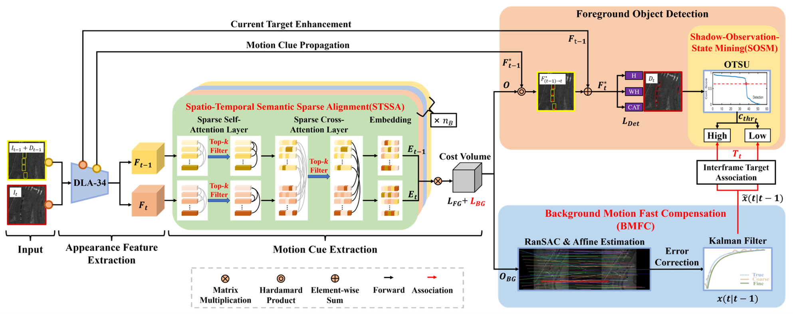

# [IEEE TGRS 2024] A Multi-Vehicle Tracking Method for Video-SAR with Reliable Foreground-Background Motion Feature Compensation

* * *

***Abstract:*** Most of the existing Video Synthetic Aperture Radar (ViSAR) vehicle multi-target tracking methods only perform inter-frame association based on the idea of appearance modeling, and are not closely integrated with the ViSAR moving target imaging characteristics, resulting in limited accuracy improvement of existing multi-target tracking methods. ViSAR moving targets have the characteristics of individual similarity, time-varying appearance and background pseudo-motion, which have a great impact on tracking performance. In this regard, we propose a multi-vehicle tracking method for ViSAR with reliable foreground-background motion feature compensation (RFBMFC). Specifically, in order to improve the distinguishability of individual features, the spatial-temporal semantic sparse alignment (STSSA) module with intra-frame and inter-frame context key information aggregation and interaction is constructed in the feature extraction stage, which can generate more accurate dense optical flow to enhance the detection and association of foreground targets. In order to improve the tracking continuity of foreground targets with time-varying appearance, the shadow-observation-state mining (SOSM) module is designed in the inter-frame association stage, which can cluster targets under different appearance states and adaptively restore lost target trajectories. In addition, the background motion fast compensation (BMFC) module is designed, which can learn background motion estimation and correct the trajectory prediction error of foreground targets in an end-to-end self-supervised manner to improve the multi-target tracking accuracy under camera motion. Tests on datasets captured by Sandia National Laboratories (SNL) and Beijing Institute of Radio Measurement (BIRM) show that RFBMFC outperforms many representative multi-target tracking methods. Compared with the suboptimal method, RFBMFC improves the multi-object-tracking accuracy (MOTA) by 1.10\% on the SNL data, and by 5.00\% on the BIRM data, verifying the effectiveness of RFBMFC.



* * *

## Install

My env:

- Ubuntu 20.04
- CUDA 11.7

```bash
$ git clone https://github.com/hongjianzhi/MTT-RFBMFC.git
$ conda create -n MTT-RFBMFC python=3.7
$ source activate MTT-RFBMFC
$ pip install torch==1.7.1+cu110 torchvision==0.8.2+cu110 -c pytorch
$ pip install -r requirements.txt 
```

- - -

## Inference

Due to the restrict of large file size of git, please download the trained MTT-RFBMFC in [Baidu Netdisk Link](https://pan.baidu.com/s/1p8fjTpjCNcB7m2vwo6XXmQ?pwd=gpgs), and put it into `./models`.

For inference, run

```bash
$ bash ./inference.sh
```

or

```bash
$ CUDA_VISIBLE_DEVICES=0 python ./src/test.py tracking 
        --exp_id mot17_fulltrain_SNL
        --dataset mot
        --dataset_version 17test
        --load_model ./models/RFBMFC_50e_SNL_768_768.pth
        --input_h 768
        --input_w 768
        --pre_hm
        --ltrb_amodal
        --inference
        --trades
        --save_video
        --save_all
```

- - -

## Acknowledgement

We sincerely thank the anonymous reviewers for their insightful criticism and suggestions on this article, which have improved its presentation from the original version.
